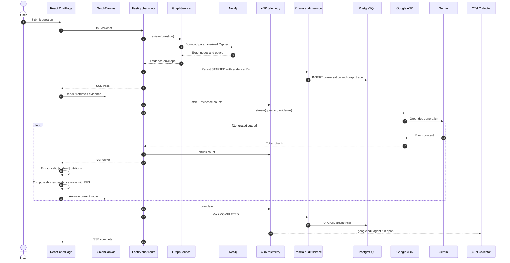
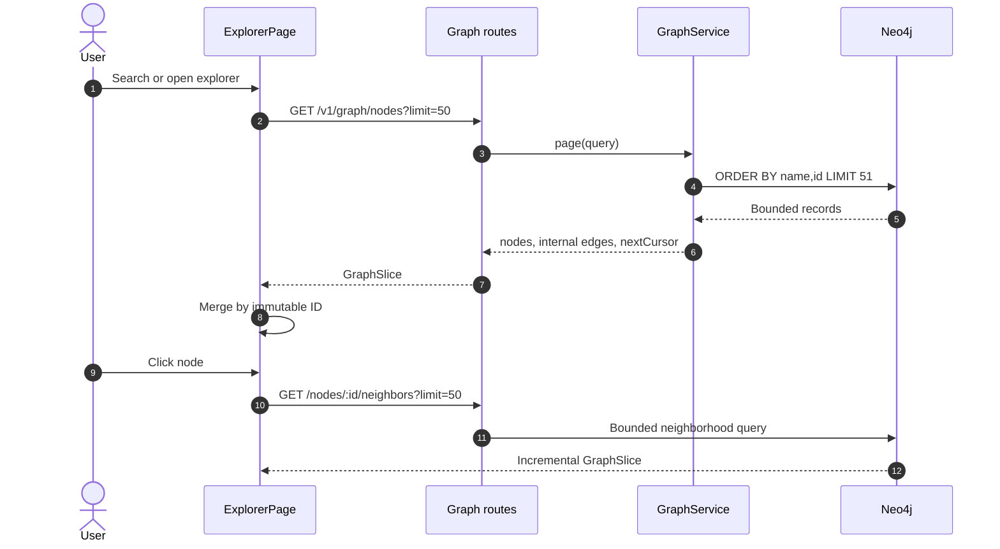
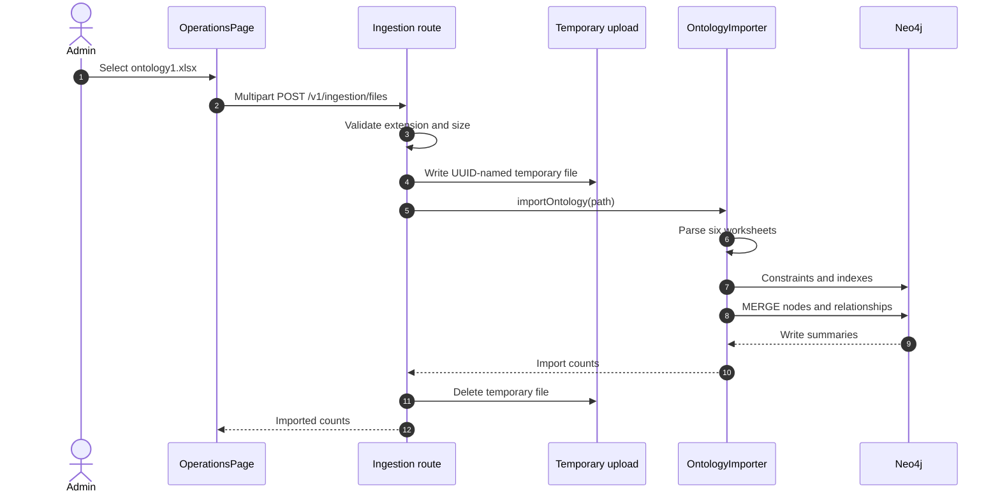
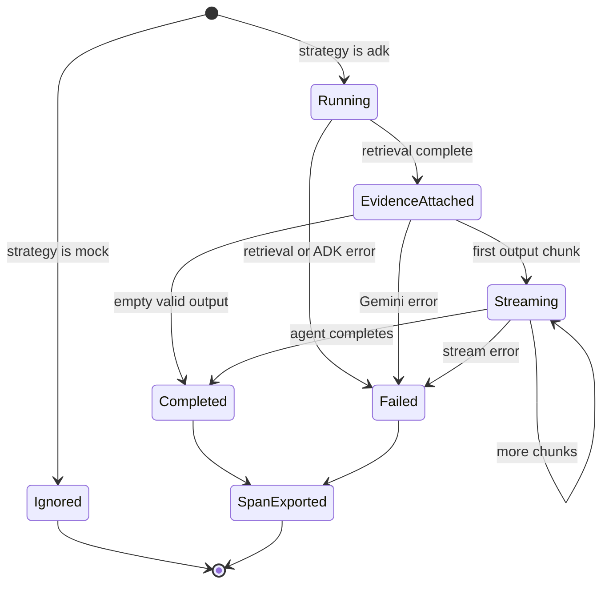
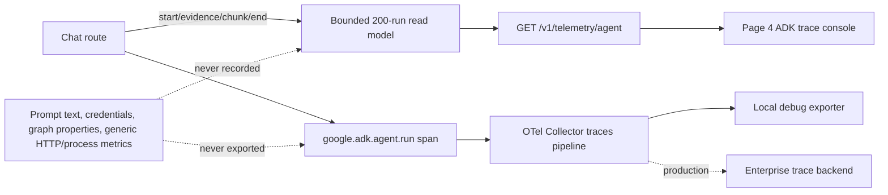
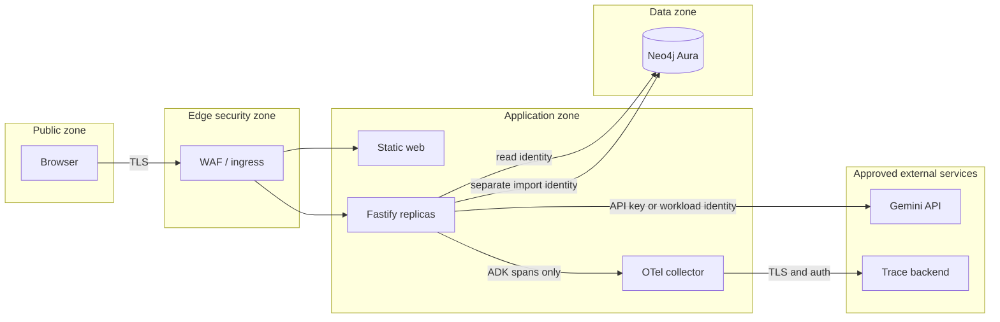
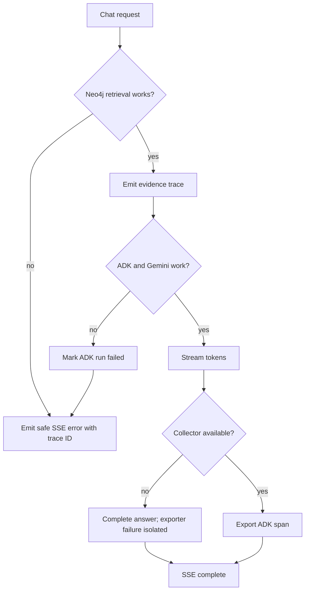
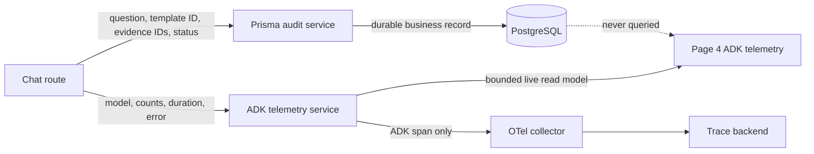
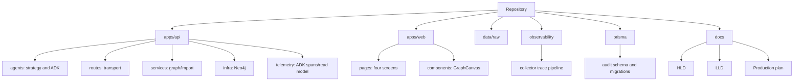

# Architecture diagram catalog

All diagrams describe current implementation unless marked `future production`.

## 1. End-to-end chat and evidence sequence

## 2. Explorer pagination and expansion

## 3. Workbook ingestion

## 4. ADK telemetry lifecycle

## 5. ADK telemetry data flow

## 6. Security and trust zones

## 7. Failure and degradation paths

## 8. Audit versus observability separation

## 9. Repository ownership map

