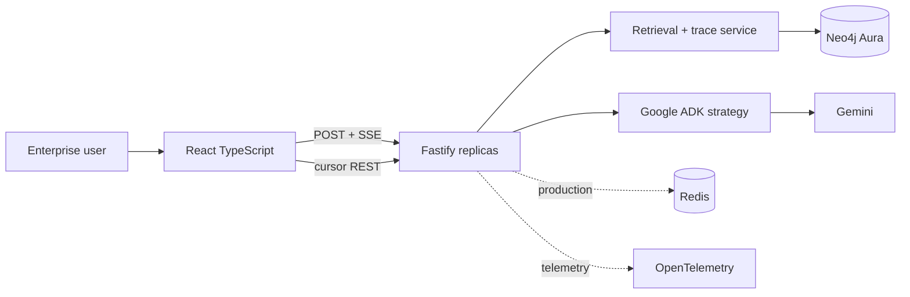

# High-level design

## Context

Platform answers enterprise questions from normalized Neo4j ontology while showing exact retrieval evidence. Three UI surfaces: live chat/evidence, paginated explorer, production architecture.

## Runtime flow

1. Browser sends question and conversation ID.
2. Fastify validates/rate-limits request and assigns request/trace IDs.
3. Retrieval runs bounded parameterized Cypher. Returned nodes/edges form immutable evidence envelope.
4. SSE sends `trace` immediately. React renders evidence subgraph.
5. Same evidence enters ADK prompt. No autonomous write/query tool is exposed.
6. SSE sends `token`, then `complete`. Audit sink stores query template ID, parameters hash, result IDs, timing and actor.

## Scale boundaries

- Fastify is stateless. Scale horizontally behind managed ingress.
- One process-wide Neo4j driver; bounded pool. Never create driver per request.
- Graph explorer uses opaque keyset cursor and max 100 nodes/page.
- Node expansion is progressive with edge/depth/result caps.
- Redis is optional locally; production uses it for distributed rate limits, short-lived trace replay and idempotency.
- Aura Free is demo-only. Production tier choice must meet HA, restore, private networking, capacity and support requirements.

## Trust boundaries

Frontend never receives Neo4j/Gemini credentials or raw Cypher. Backend derives tenant from verified OIDC claims, applies label/property policy, uses read-only Neo4j identity for query traffic, separate importer identity for ingestion.

