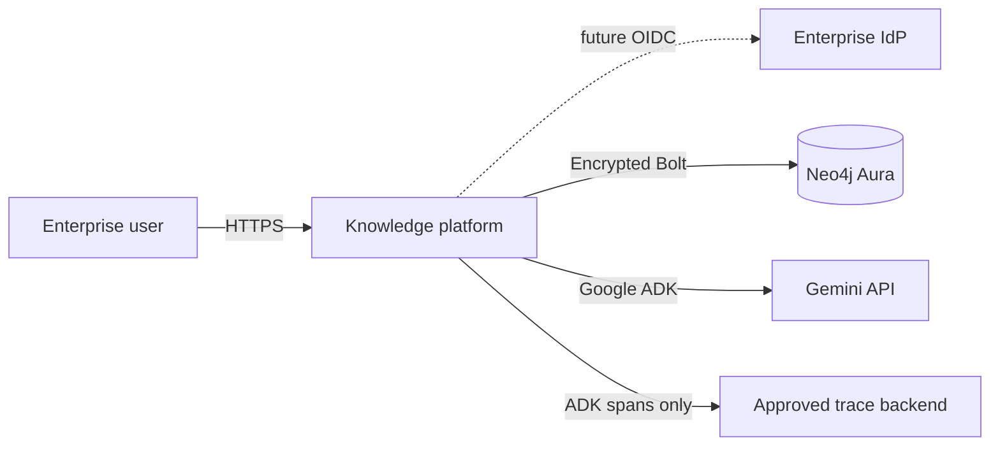
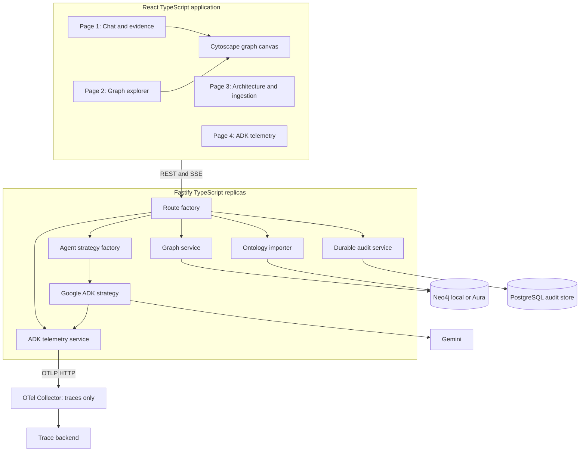
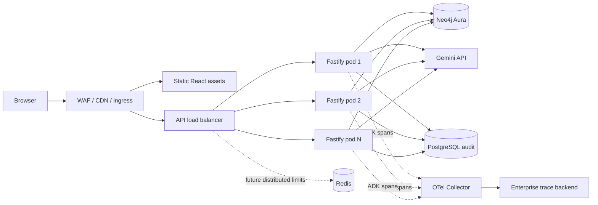

# High-level design

## System purpose

Platform answers enterprise questions from normalized Neo4j ontology, streams grounded responses, displays exact evidence, supports bounded graph exploration, imports governed sources, and exposes Google ADK-only telemetry.

## System context

## Container architecture

## Deployment topology

## Primary answer flow

1. Browser sends question and optional conversation ID.
2. Fastify validates, rate-limits, and assigns correlation/trace IDs.
3. Graph retrieval executes bounded parameterized Cypher.
4. API emits `trace` SSE event containing exact evidence nodes and edges.
5. Same evidence enters Google ADK/Gemini prompt.
6. API emits `token` events, followed by `complete` or `error`.
7. ADK telemetry records only model, counts, duration, status, and errors.
8. Prisma persists conversation, question, query-template ID, evidence IDs, and completion status as durable audit records. These records are not observability data and never feed Page 4.

## Scale boundaries

- Fastify request processing is stateless and horizontally scalable.
- One process-wide Neo4j driver uses bounded connection pooling.
- Explorer uses opaque keyset cursors and hard page limits.
- Expansion is progressive; full-graph download is not supported.
- ADK dashboard read model is process-local and capped at 200 runs. Production trace history belongs in approved OTLP backend.
- PostgreSQL audit data is durable business evidence with separate retention, access, and encryption policy.
- Redis is future production infrastructure for distributed rate limits and idempotency.
- Aura Free suits demos; industrial use requires tier selection based on HA, restore, private networking, capacity, and support.

## Trust boundaries

Frontend never receives Gemini/Neo4j credentials, raw Cypher, prompt telemetry, or graph properties in telemetry. Production must derive tenant and role policy from verified OIDC claims. Read traffic and ingestion must use separate Neo4j identities.

See [diagram catalog](DIAGRAMS.md), [LLD](LLD.md), and [production plan](PRODUCTION.md).
