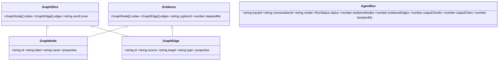
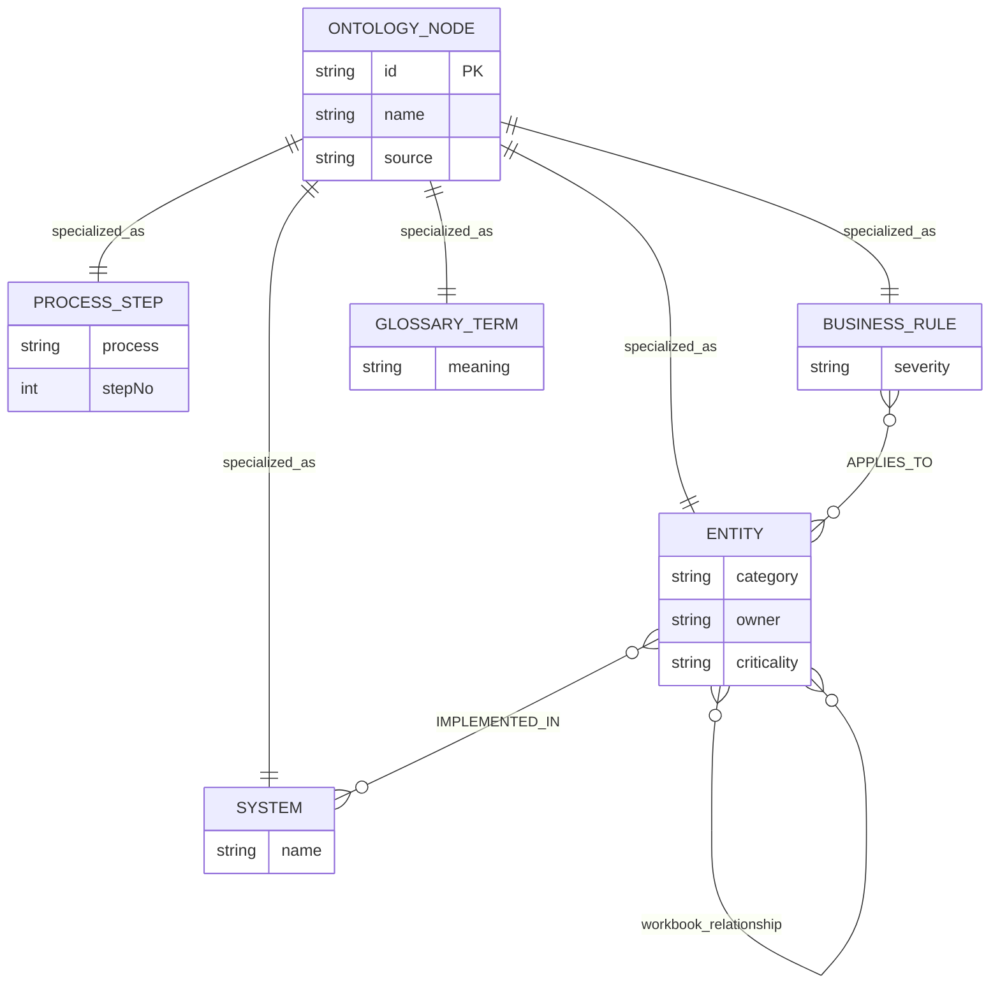
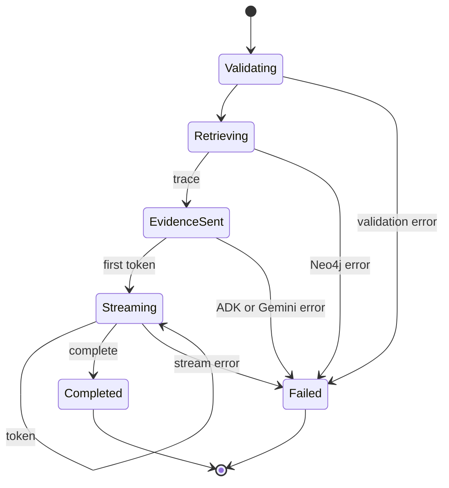
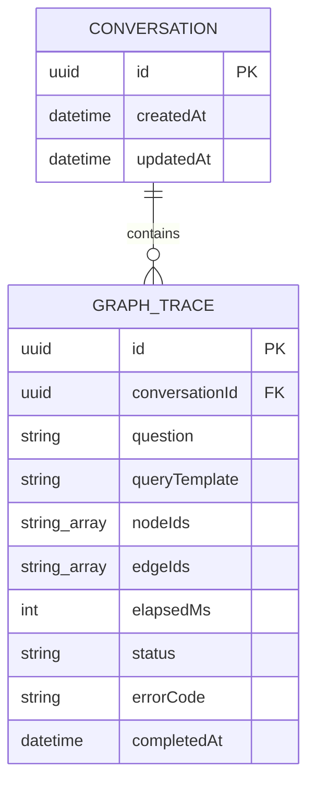
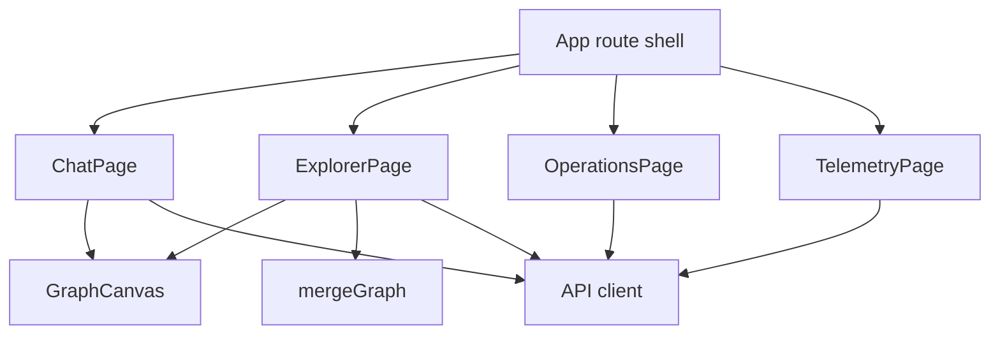

# Low-level design

## Backend modules

`registerRoutes` composes bounded Fastify plugins. Routes validate transport with Zod and delegate. `GraphService` owns approved Cypher templates and graph mapping. Agent factory selects real ADK or deterministic mock without changing transport.

## API contracts

| Method | Path | Contract |
|---|---|---|
| POST | `/v1/chat` | `{question, conversationId?}`; SSE `trace/token/complete/error` |
| GET | `/v1/graph/nodes` | `cursor,limit,search,label`; returns `GraphSlice` |
| GET | `/v1/graph/nodes/:id/neighbors` | Bounded progressive expansion |
| POST | `/v1/ingestion/files` | Multipart `.xlsx` import or staged `.txt` |
| GET | `/v1/telemetry/agent` | ADK-only summary and last 200 run records |
| GET | `/health/live` | Process liveness |
| GET | `/health/ready` | Neo4j connectivity readiness |

## Core contracts

## Normalized Neo4j model

Every discoverable node has `:OntologyNode`, immutable `id`, display `name`, and `source`. Additional labels specialize nodes. Workbook relationship names remain semantic relationship types.

## Pagination algorithm

Top-level browse orders by `(coalesce(name,id), id)`. Opaque cursor encodes last pair. Query requests `limit + 1`; extra record determines `nextCursor`. Maximum response is enforced server-side. Neighbor expansion is locally bounded; future high-degree evolution should keyset on `(other.id, relationship.elementId)`.

## SSE state machine

## ADK-only telemetry

Telemetry starts only when `AGENT_STRATEGY=adk`. It never runs for mock strategy. OTLP span name is `google.adk.agent.run`. Attributes contain model, session ID, question character count, evidence counts, retrieval duration, output counts, total duration, and error status. Prompt text and graph properties are excluded.

Recent-run dashboard state is capped at 200 entries per API process. It is operational convenience, not durable audit history.

## Durable audit persistence

Prisma/PostgreSQL is separate from observability. `Conversation` owns ordered `GraphTrace` records. Each trace persists question, approved query-template ID, exact evidence node/edge IDs, retrieval duration, status, timestamps, and safe error code. Page 4 never queries these tables. Production access requires restricted audit roles and retention controls.

## Frontend modules

- Page 1 incrementally parses SSE and renders evidence.
- Page 2 merges graph pages by immutable IDs and expands clicked nodes.
- Page 3 uploads governed sources and presents architecture guardrails.
- Page 4 polls ADK-only run telemetry every three seconds.

## Failure behavior

- Neo4j unavailable: readiness returns 503; graph/chat request fails safely with request ID.
- Gemini/ADK failure: evidence remains visible; SSE sends `error`; telemetry run becomes `FAILED`.
- OTLP collector unavailable: agent response continues; exporter failure must not break chat.
- Browser disconnect: response closes. Production should propagate abort signals to ADK and Neo4j work.
- Duplicate workbook import: stable IDs and `MERGE` keep ingestion repeatable.
- Invalid or oversized upload: rejected before import; temporary server-generated path is removed.

See [diagram catalog](DIAGRAMS.md) for complete sequences and deployment views.
