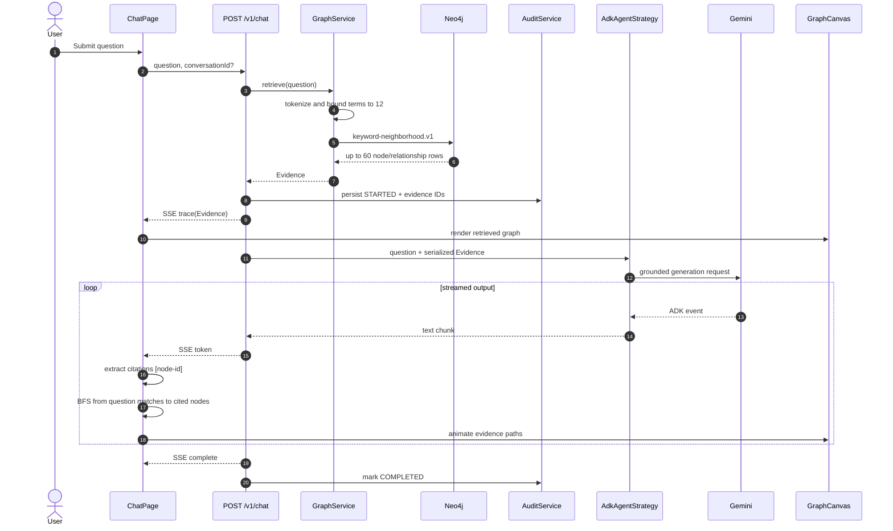
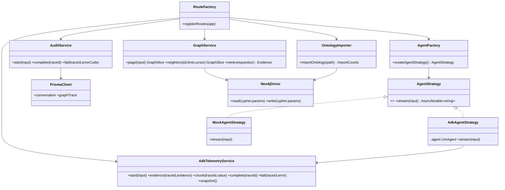
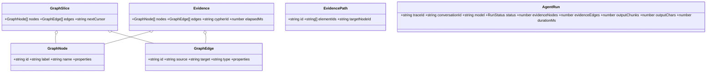
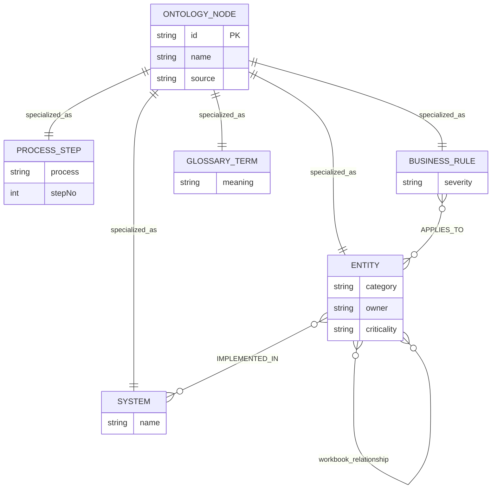
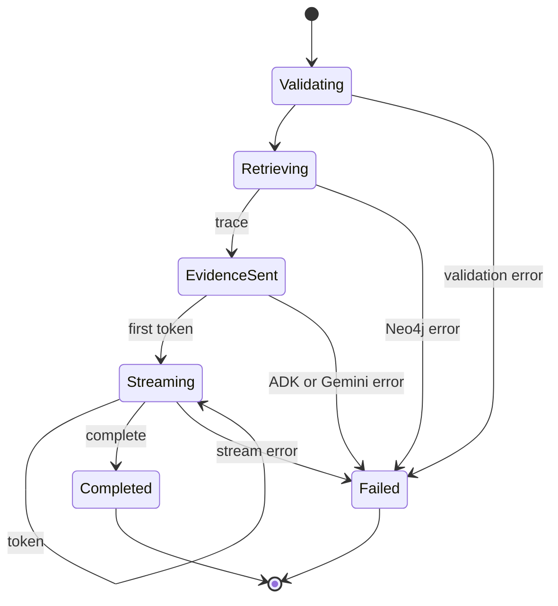
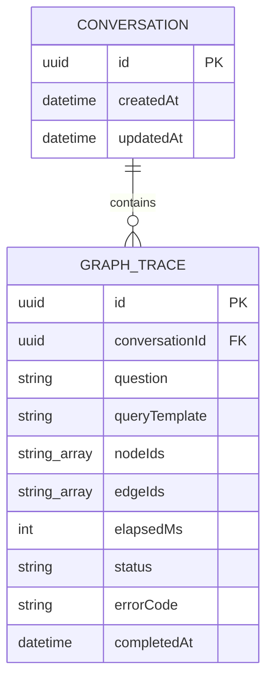
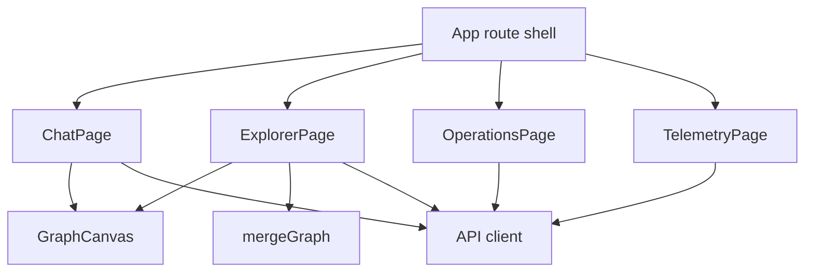

# Low-level design

## Scope and implementation status

This document describes deployed code, not an aspirational agent workflow. Current graph retrieval happens before Gemini. Current animated answer path is derived in the browser after Gemini emits cited node IDs. It is a shortest-path visualization over retrieved evidence; it is not Gemini chain-of-thought.

## Chat execution sequence



### Ordering guarantee

`trace` is emitted before first `token`. Frontend can therefore render evidence before model output arrives. Citation-dependent animation begins only after a streamed answer contains IDs that exist in received evidence.

### Current path semantics

```text
candidate starts = top 3 retrieved nodes ranked by question-term matches
targets          = first 4 valid [node-id] citations in streamed answer
path             = shortest undirected BFS route from any start to each target
animation        = node, edge, node order for every discovered route
```

This route explains graph connectivity between question context and cited evidence. It does not expose or approximate hidden model reasoning.

## Backend modules



`registerRoutes` composes bounded Fastify plugins. Routes validate transport with Zod and delegate. `GraphService` owns approved Cypher templates and graph mapping. Agent factory selects real ADK or deterministic mock without changing transport.

## API contracts

| Method | Path | Contract |
|---|---|---|
| POST | `/v1/chat` | `{question, conversationId?}`; SSE `trace/token/complete/error` |
| GET | `/v1/graph/nodes` | `cursor,limit,search,label`; returns `GraphSlice` |
| GET | `/v1/graph/nodes/:id/neighbors` | Bounded progressive expansion |
| POST | `/v1/ingestion/files` | Multipart `.xlsx` import or staged `.txt` |
| GET | `/v1/telemetry/agent` | ADK-only summary and last 200 run records |
| GET | `/health/live` | Process liveness |
| GET | `/health/ready` | Neo4j connectivity readiness |

## Core contracts



### Transport types

```ts
type ChatRequest = {
  question: string;          // trimmed, 2..2000 characters
  conversationId?: string;  // UUID
};

type TraceEvent = Evidence & {
  traceId: string;
  conversationId: string;
};

type TokenEvent = { token: string };
type CompleteEvent = { traceId: string; conversationId: string };
type ErrorEvent = { message: string; traceId: string };
```

SSE frame format:

```text
event: <trace|token|complete|error>
data: <single-line JSON>

```

## Retrieval implementation

`GraphService.retrieve` performs deterministic, bounded retrieval:

1. Lowercase question.
2. Split on non-identifier characters.
3. Keep tokens longer than two characters.
4. Keep maximum 12 terms.
5. Match nodes where `name`, `description`, or `id` contains any term.
6. Limit seed nodes to 12.
7. Expand one undirected hop.
8. Limit result rows to 60.
9. Deduplicate nodes and relationships by stable ID.

Cypher values are parameters. Question text never becomes executable Cypher.

Complexity bounds:

| Operation | Bound |
|---|---:|
| Query terms | 12 |
| Matching seed nodes | 12 |
| Returned rows | 60 |
| Browser path targets | 4 |
| Browser candidate starts | 3 |
| Path search | `O(V + E)` per start/target pair |

## Frontend chat state

| State | Owner | Meaning |
|---|---|---|
| `question` | `ChatPage` | Composer draft; cleared immediately after accepted submit |
| `submittedQuestion` | `ChatPage` | Immutable question for active response |
| `answer` | `ChatPage` | Accumulated streamed output |
| `nodes`, `edges` | `ChatPage` | Exact server `trace` evidence |
| `busy` | `ChatPage` | Prevents concurrent submission |
| `citedNodeIds` | derived | Valid answer citations present in evidence |
| `evidenceRoutes` | derived | BFS paths for visualization |
| `evidenceMode` | `ChatPage` | normal, expanded, or minimized |

Token rendering is coalesced through `requestAnimationFrame` to avoid one React render per network chunk.

## GraphCanvas rules

- Reject edges whose endpoints are absent.
- Reject self-loops in this view.
- Deduplicate parallel edges with identical source, target, and type.
- Hide arrowheads and labels on background relationships.
- Show direction and label only for active answer-path edges.
- Fade unrelated elements during route playback.
- Run each evidence route separately; never flatten multiple paths into one false route.
- Resize canvas without automatically refitting on every observer event.
- Fit after layout completion and when user requests fit/fullscreen.

## Exact server-owned path evolution

For compliance-grade provenance, move path selection into backend retrieval and extend `Evidence`:

```ts
type EvidencePath = {
  id: string;
  elementIds: string[];      // alternating node and relationship IDs
  targetNodeId: string;
  retrievalReason: 'keyword-neighborhood' | 'explicit-traversal';
};

type Evidence = {
  nodes: GraphNode[];
  edges: GraphEdge[];
  paths: EvidencePath[];
  cypherId: string;
  elapsedMs: number;
};
```

Migration rule: backend returns `paths`; Gemini receives same paths; audit persists path IDs; frontend only animates returned `elementIds`. This removes browser heuristic divergence while still avoiding claims about model chain-of-thought.

## Normalized Neo4j model



Every discoverable node has `:OntologyNode`, immutable `id`, display `name`, and `source`. Additional labels specialize nodes. Workbook relationship names remain semantic relationship types.

## Pagination algorithm

Top-level browse orders by `(coalesce(name,id), id)`. Opaque cursor encodes last pair. Query requests `limit + 1`; extra record determines `nextCursor`. Maximum response is enforced server-side. Neighbor expansion is locally bounded; future high-degree evolution should keyset on `(other.id, relationship.elementId)`.

## SSE state machine



## ADK-only telemetry

Telemetry starts only when `AGENT_STRATEGY=adk`. It never runs for mock strategy. OTLP span name is `google.adk.agent.run`. Attributes contain model, session ID, question character count, evidence counts, retrieval duration, output counts, total duration, and error status. Prompt text and graph properties are excluded.

Recent-run dashboard state is capped at 200 entries per API process. It is operational convenience, not durable audit history.

## Durable audit persistence

Prisma/PostgreSQL is separate from observability. `Conversation` owns ordered `GraphTrace` records. Each trace persists question, approved query-template ID, exact evidence node/edge IDs, retrieval duration, status, timestamps, and safe error code. Page 4 never queries these tables. Production access requires restricted audit roles and retention controls.



## Frontend modules



- Page 1 incrementally parses SSE and renders evidence.
- Page 2 merges graph pages by immutable IDs and expands clicked nodes.
- Page 3 uploads governed sources and presents architecture guardrails.
- Page 4 polls ADK-only run telemetry every three seconds.

## Failure behavior

- Neo4j unavailable: readiness returns 503; graph/chat request fails safely with request ID.
- Gemini/ADK failure: evidence remains visible; SSE sends `error`; telemetry run becomes `FAILED`.
- OTLP collector unavailable: agent response continues; exporter failure must not break chat.
- Browser disconnect: response closes. Production should propagate abort signals to ADK and Neo4j work.
- Duplicate workbook import: stable IDs and `MERGE` keep ingestion repeatable.
- Invalid or oversized upload: rejected before import; temporary server-generated path is removed.

See [diagram catalog](DIAGRAMS.md) for complete sequences and deployment views.
